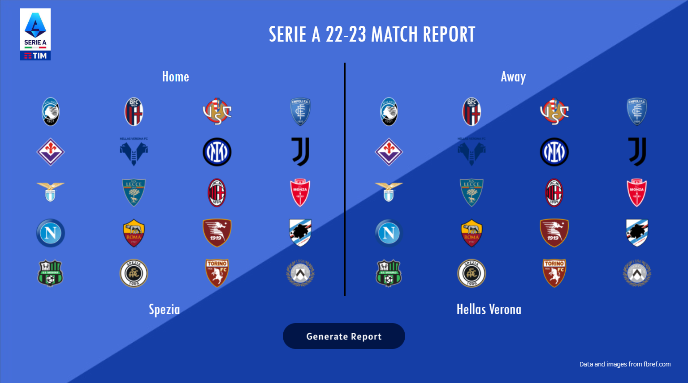

In this repo you can find the code use to extract the data for the final project of the third edition of the *Tableau: Data Visualization per Football Data Analyst* course.

To see the interactive dashboard visit my [Tableau public acocunt](https://public.tableau.com/app/profile/edoardo.marchetti) or click [here](https://public.tableau.com/app/profile/edoardo.marchetti/viz/FootballAnalysis-SerieA22-23MatchReportGenerator/FirstPage)
